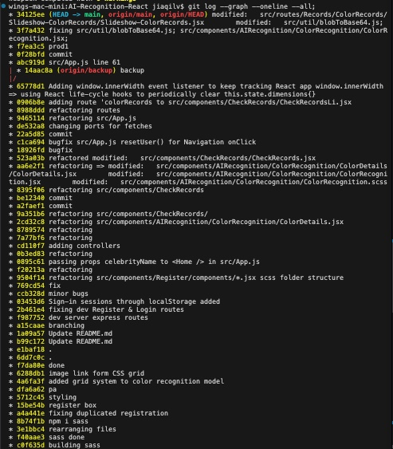
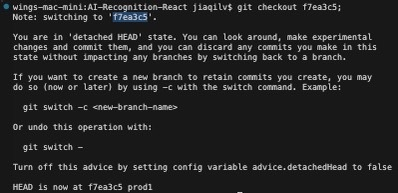

<h2>Restoring from a git hashcode</h2>
<br/>

<h2>Checking all git hashcode records</h2>
<br/>

```bash
git log --graph --oneline --all;
```


<br/>

<h2>Restoring to a point using a specific git hashCode</h2>

<br/>

```bash
git checkout <gitHash>;
```

<br/>
<br/>

<h2>Restoring from git HEADs</h2>
```bash
git log;
```

<h2>1. Restoring to a specific git HEAD point</h2>

```bash
git checkout <HEAD>;
```

<h2>2. Create a new branch from the current detached HEAD state</h2>

```bash
git branch <tempBranchName>;
```

<h2>3. Switch to the New Branch</h2>

```bash
git checkout <tempBranchName>;
```

<h2>4. Merge the new branch into main</h2>

```bash
git checkout main;
git pull origin main;
```

<h2>5. Merge temp branch into main</h2>
```bash
git merge <tempBranchName>;
```

<h2>6. Push the changes to remote repository</h2>
```bash
git push origin main;
```

<h2>7. Clean up the temp branch after merging</h2>
```bash
git branch -d <tempBranchName>;
```

<br/>
<br/>

<h2>Restoring a file from current git hash point</h2>

```bash
git restore <path/fileName.ext>;
```
